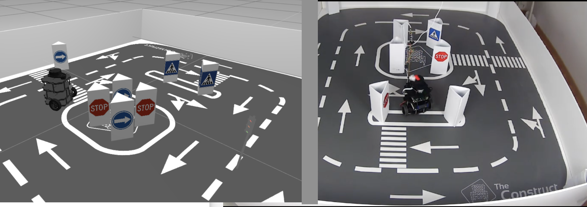

# CheckPoint 3 ROS2 Basics CPP

<!-- TABLE OF CONTENTS -->

  
Table of Contents

  <ol>
    <li>
      <a href="#about-the-project">About The Project</a>
    </li>
    <li>
      <a href="#getting-started">Getting Started</a>
      <ul>
        <li><a href="#software-prerequisites">Software Prerequisites</a></li>
        <li><a href="#hardware-prerequisites">Hardware Prerequisites</a></li>
        <li><a href="#installation">Installation</a></li>
      </ul>
    </li>
    <li><a href="#usage">Usage</a></li>
    <li><a href="#real-robot">Real Robot</a></li>
  </ol>

## About The Project
Turtlebot 3 project 

<!-- GETTING STARTED -->
## Getting Started

### Software Prerequisites
* Ubuntu 22.04
* ROS2 Humble
